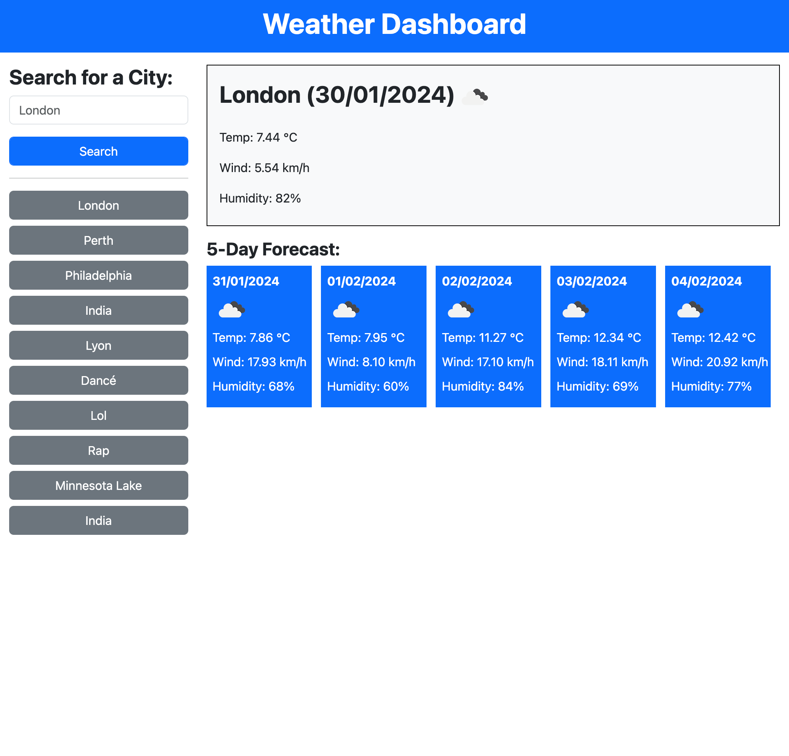

# Weather Dashboard

## Description
Weather Dashboard is a weather forecasting application that allows users to search for the weather in regions all over the world. Users are cleanly presented details of the current weather along with a 5-day forecast for the following days. The site is designed to be responsive and uses images to make checking the weather a pleasant and visually engaging experience.



## Installation

Please clone this repository with the following command in your terminal:

```
git clone https://github.com/jamesaps/weather-dashboard.git
```

## Usage
This site is designed to automatically deploy to github pages when changes are committed to the main branch. You can find a link to a live version of the site [here](https://jamesaps.github.io/weather-dashboard/).

## Credits
* Starter code provided by edX Boot Camps LLC.
* reset.css provided by [meyerweb.com](https://meyerweb.com/eric/tools/css/reset/)
* sleep function provided by [sitepoint.com](https://www.sitepoint.com/delay-sleep-pause-wait/)
* API and weather icons provided by [OpenWeather](https://openweathermap.org/)